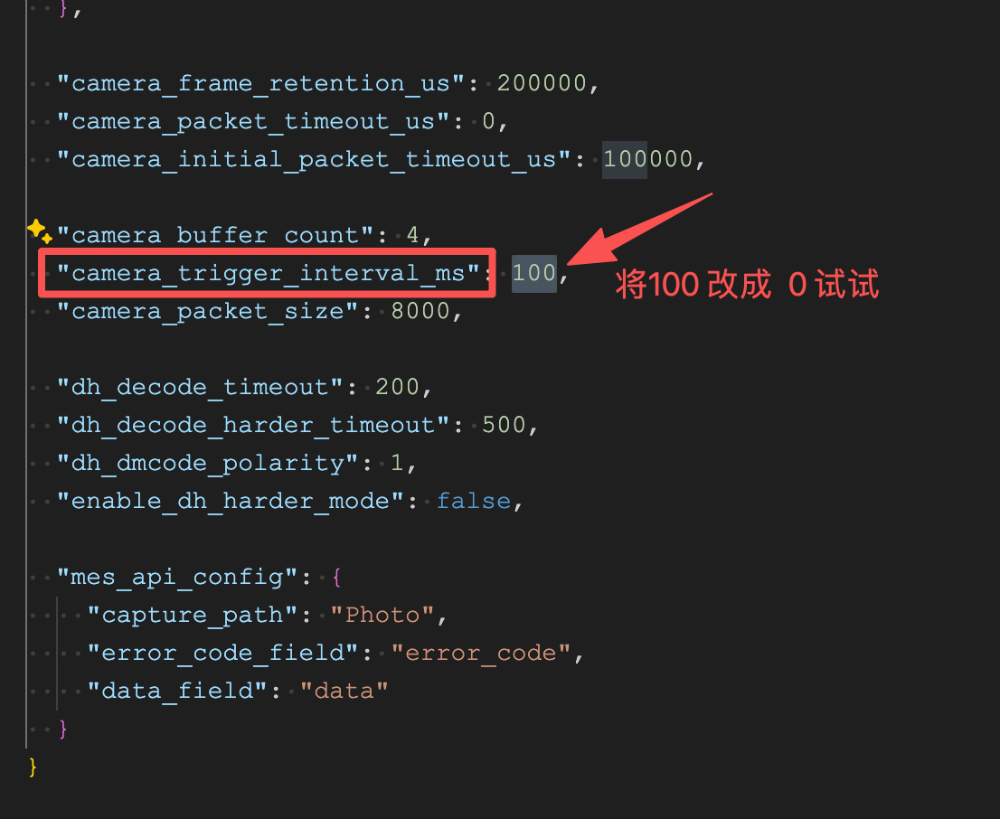

# 拍照超时警告问题

## 现场问题

CCD 间隔一段时间会提示警告：
- `buffer timeout or unavailable`
- `buffer status not success`

调度端反映为**一直无法拿到拍照结果**，并且界面**一直显示等待拍照完成**。

## 排查过程

1. **检查服务重启机制**：确认日志程序的自动重启服务在遇到上述错误时是否正常重启服务。
2. **确认调度行为**：检查该时间点调度是否有重复执行拍照操作。
3. **分析错误时机**：
   - **启动/重启阶段报错**：可能是相机尚未准备就绪
   - **运行一段时间后报错**：考虑压力过大或巨型帧未开启等原因

> **处理建议**：
> - **若错误不频繁、不影响生产业务，可考虑忽略此类错误**
> - 若错误频繁出现，且无自动重启服务或影响生产，请参考以下解决方案

## 可能原因和解决方法

### 1. 未关闭性能模式

运行程序时，`camera_trigger_interval_ms` 参数为 `100` 时，会为了提升识别率消耗额外性能。在当前 CCD 识别率已达标的情况下，建议将该参数设置为 `0`。

**修改路径**：`D:/yocto/vsentry/vsentry.json`

**配置项**：
```json
{
  "camera_trigger_interval_ms": 0
}
```



### 2. 系统基础配置
1.关闭系统防火墙
2.电池休眠关闭
3.巨型帧 9014 开启

### 3. 调度端配置

**可能原因**：
调度需要拿到拍照的结果才会结束，但是有时候会拿到一个空的结果/报错等异常情况，这样就会陷入死循环。         

**解决方法**：
> 调度端修改逻辑，增加超时时间，使调度在一定时间内（5s）拿不到结果，就会重新触发拍照。