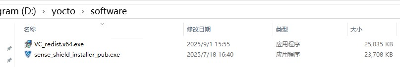

# 相机无法接入原因分析和解决方案

## 现象描述
运行YoctoVisionAI.exe,可能会弹出“获取相机信息失败，是否跳过检测直接进入程序”，等待5s，点击确认重新尝试获取相机权限。然而，在多次重复此操作后，程序仍未能成功启动，该错误弹窗会持续循环出现，导致无法正常进入软件主界面。     
    

## 可能原因和解决方案
### 1. 相关程序安装问题（新机）
#### 1.vc_redist.x64.exe未安装
对于新部署的设备，出现上述问题，请首先确认是否安装相关运行库安装包vc_redist.x64.exe，此安装包是确保YoctoVisionAI软件能正常调用系统API接口并稳定启动与运行的先决条件。若缺少此组件，软件将无法启动并报错。          

解决方案：       
安装vc_redist.x64.exe，该安装程序已预先置于YoctoVisionAI.zip压缩包的software目录中，请在启动主程序前完成安装。           

      

#### 2.YoctoVisionAI.exe文件位置
软件运行时，请将yocto文件夹放置在D盘根目录，否则，系统将无法识别该软件。      

自检方案：      
鼠标右键选中YoctoVisionAI的快捷方式，选择打开文件位置，看是否在D盘根目录下。    

解决方案：     
将软件放置在D盘根目录下。

#### 3. OPT相机未设置DHCP
对于新接入的OPT相机设备，其默认地址为：192.168.10.2，请确保其已设置DHCP，否则，相机无法正常连接。

自检方案：           
MV viewer程序中，相机IP地址为192.168.10.2，且打开YoctoVisionAI软件，软件无法启动。

解决方案：        
使用OPT相机软件，根据部署文档将相机设置为DHCP，获取到IP地址后，再启动YoctoVisionAI或者MV Viewer软件进行调焦。

### 2. 硬件连接问题(高频)
在已部署并稳定运行的生产系统中，工业相机的连接稳定性需要持续关注，对于非新接入的相机设备，其物理连接组件会因长期运行而自然老化，同时，工厂现场环境的动态性，如人员往来、物料搬运产生的振动或意外触碰，均可能造成相机物理连接瞬时中断或信号干扰。当相机因上述原因断线后，系统在启动自检阶段进行设备枚举时，检测到的实际在线相机数量会与相机配置文件（D:\yocto\vsentry\sentry.ini）中预设的相机数量参数不一致。此数量不匹配会触发软件的安全校验机制，为防止相机资源缺失导致图像采集流程异常或视觉识别逻辑错误，系统将中止启动过程，并提示“获取相机信息失败，是否跳过检测直接进入程序”的错误弹窗，阻止用户进入软件主界面。         

自检方案：       
使用键盘windows+R键打开运行管理Yocto器，输入cmd，进入命令行。再输入D:,进入d盘;        
输入菜单 cd D:\yocto\vsentry\vsentry.exe,（多个vsentry文件中内存最大的那个），独立运行后端程序，可以根据提示的相机编号错误确认出现错误的相机。（出现此类错误时典型现象为MV Viewer软件可以显示到相机，但关闭MV Viewer软件后，程序仍无法启动）      

解决方案：        
修改sentry.ini文件，将预设的相机数量参数改为0，让系统自动检测相机数量，即可解决该问题。（最有效）

### 3. 相机被其他软件占用
使用MV Viewer软件进行调焦和打光测试后，MV VViewer软件没有及时关闭，同时已经打开了YoctoVisionAI软件，此时MV Viewer软件会占用相机的USB端口，导致YoctoVisionAI软件无法连接到相机启动。    

解决方案：     
关闭MV Viewer软件，再重新启动YoctoVisionAI软件。        

## 问题记录
-2025.11.10 原因2：工控机扩展网卡端口接触不良，导致端口相机频繁掉线。     
-2025.12.11 原因1-1：未安装vc_redist.x64.exe，导致相机api无法调用。      
-2025.12.11 原因1-3：相机未设置DHCP，无法正常连接。    
-2025.12.18 原因1-2：yocto文件夹位置设置为了“D:\CCD\Yocto"      
-2025.12.26 原因2：工控机四相机，掉线了一个相机，相机个数和配置文件不一致     

