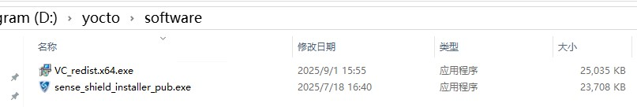

# 相机无法接入原因分析和解决方案

## 现象描述
运行 YoctoVisionAI.exe 时，可能会弹出“获取相机信息失败，是否跳过检测直接进入程序”提示，等待 5s 后点击确认会重新尝试获取相机权限。然而，在多次重复此操作后，程序仍未能成功启动，该错误弹窗会持续循环出现，导致无法正常进入软件主界面。

## 可能原因和解决方案

### 1. 相关程序安装问题（新机）

#### 1.1 vc_redist.x64.exe 未安装
对于新部署的设备，出现上述问题，请首先确认是否安装相关运行库安装包 vc_redist.x64.exe，此安装包是确保 YoctoVisionAI 软件能正常调用系统 API 接口并稳定启动与运行的先决条件。若缺少此组件，软件将无法启动并报错。

**解决方案**：
安装 vc_redist.x64.exe，该安装程序已预先置于 YoctoVisionAI.zip 压缩包的 software 目录中，请在启动主程序前完成安装。

#### 1.2 YoctoVisionAI.exe 文件位置
软件运行时，请将 yocto 文件夹放置在 D 盘根目录，否则，系统将无法识别该软件。

**自检方案**：
鼠标右键选中 YoctoVisionAI 的快捷方式，选择打开文件位置，看是否在 D 盘根目录下。

**解决方案**：
将软件放置在 D 盘根目录下。

#### 1.3 OPT 相机未设置 DHCP
对于新接入的 OPT 相机设备，其默认地址为：192.168.10.2，请确保其已设置 DHCP，否则，相机无法正常连接。

**自检方案**：
MV viewer 程序中，相机 IP 地址为 192.168.10.2，且打开 YoctoVisionAI 软件，软件无法启动。

**解决方案**：
使用 OPT 相机软件，根据部署文档将相机设置为 DHCP，获取到 IP 地址后，再启动 YoctoVisionAI 或者 MV Viewer 软件进行调焦。

### 2. 硬件连接问题（高频）
在已部署并稳定运行的生产系统中，工业相机的连接稳定性需要持续关注，对于非新接入的相机设备，其物理连接组件会因长期运行而自然老化。同时，工厂现场环境的动态性，如人员往来、物料搬运产生的振动或意外触碰，均可能造成相机物理连接瞬时中断或信号干扰。

当相机因上述原因断线后，系统在启动自检阶段进行设备枚举时，检测到的实际在线相机数量会与相机配置文件（D:\yocto\vsentry\sentry.ini）中预设的相机数量参数不一致。此数量不匹配会触发软件的安全校验机制，为防止相机资源缺失导致图像采集流程异常或视觉识别逻辑错误，系统将中止启动过程，并提示“获取相机信息失败，是否跳过检测直接进入程序”的错误弹窗，阻止用户进入软件主界面。

**自检方案**：
1. 使用键盘 Windows+R 键打开运行管理器，输入 cmd，进入命令行
2. 输入 D:，进入 D 盘
3. 输入 cd D:\yocto\vsentry，进入目录
4. 运行 vsentry.exe（多个 vsentry 文件中内存最大的那个），独立运行后端程序
5. 根据提示的相机编号错误确认出现错误的相机

**注**：出现此类错误时典型现象为 MV Viewer 软件可以显示到相机，但关闭 MV Viewer 软件后，程序仍无法启动。

**解决方案**：
修改 sentry.ini 文件，将预设的相机数量参数改为 0，让系统自动检测相机数量，即可解决该问题。（最有效）

### 3. 相机被其他软件占用
使用 MV Viewer 软件进行调焦和打光测试后，MV Viewer 软件没有及时关闭，同时已经打开了 YoctoVisionAI 软件，此时 MV Viewer 软件会占用相机的 USB 端口，导致 YoctoVisionAI 软件无法连接到相机启动。

**解决方案**：
关闭 MV Viewer 软件，再重新启动 YoctoVisionAI 软件。

## 问题记录

- 2025.11.10 原因 2：工控机扩展网卡端口接触不良，导致端口相机频繁掉线
- 2025.12.11 原因 1.1：未安装 vc_redist.x64.exe，导致相机 API 无法调用
- 2025.12.11 原因 1.3：相机未设置 DHCP，无法正常连接
- 2025.12.18 原因 1.2：yocto 文件夹位置设置为了 "D:\CCD\Yocto"
- 2025.12.26 原因 2：工控机四相机，掉线了一个相机，相机个数和配置文件不一致