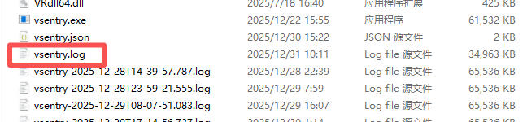

# 调试日志导出说明
在生产线上，调度人员时常会遇到各种问题，例如无法获取相机信息，或读码识别结果失败等。这类问题往往难以快速定位原因，加之产线现场通常无法直接联系技术人员进行远程调试。此时，可将后端相关日志发送给官方支持人员，由其协助分析日志，进而提供相应的技术支持。     
    
# 日志导出操作步骤
## 定位文件
在发生问题的工控电脑上，打开“此电脑”或“文件资源管理器”。       
在搜索地址栏路径：`D:\yocto\vseentry`​ 并按回车，即可进入该应用程序目录。        
   

## 查找目标文件
在文件夹内的文件列表中，找到名为 vsentry.log​ 的文件。          
           

## 复制与发送
右键单击 vsentry.log文件，选择“复制”。          
粘贴到便捷位置：在桌面或其它方便找到的位置（如`D:`根目录）右键单击，选择“粘贴”。这样会生成一个副本。        
您可以将此副本文件直接发送给技术支持人员。
如果文件较大，建议先将其放入一个新建文件夹，然后将整个文件夹压缩为 .zip或 .rar格式再发送，以确保文件完整性。         

## 温馨提示
请在问题发生后的第一时间导出并发送日志，以确保日志记录了最新的错误信息，方便技术团队精准分析。如果日志过多可以将问题日志清空重新开始记录问题，并将最新日志发送给技术支持。         
 
## 问题日志
2025.12.19 