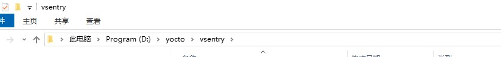
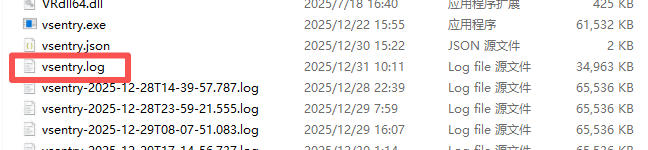

# 调试日志导出说明

在生产线上，调度人员时常会遇到各种问题，例如：
1. 无法获取相机信息
2. 读码识别结果失败

这类问题往往难以快速定位原因，加之产线现场通常无法直接联系技术人员进行远程调试。此时，可将后端相关日志发送给官方支持人员，由其协助分析日志，进而提供相应的技术支持。

# 日志导出操作步骤

## 1. 定位文件

1. 在发生问题的工控电脑上，打开“此电脑”或“文件资源管理器”
2. 在搜索地址栏输入路径：`D:\yocto\vseentry` 并按回车，即可进入该应用程序目录

## 2. 查找目标文件

在文件夹内的文件列表中，找到名为 vsentry.log 的文件

## 3. 复制与发送

1. 右键单击 vsentry.log 文件，选择“复制”
2. 粘贴到便捷位置：
   - 在桌面或其它方便找到的位置（如 `D:` 根目录）右键单击
   - 选择“粘贴”，这样会生成一个副本
3. 将此副本文件发送给技术支持人员
4. 如果文件较大，建议：
   - 将其放入一个新建文件夹
   - 将整个文件夹压缩为 .zip 或 .rar 格式
   - 然后再发送，以确保文件完整性

## 4. 温馨提示

1. 请在问题发生后的第一时间导出并发送日志，以确保日志记录了最新的错误信息
2. 这样可以方便技术团队精准分析问题
3. 如果日志过多：
   - 可以将问题日志清空
   - 重新开始记录问题
   - 然后将最新日志发送给技术支持

## 5. 问题日志

- 2025.12.19