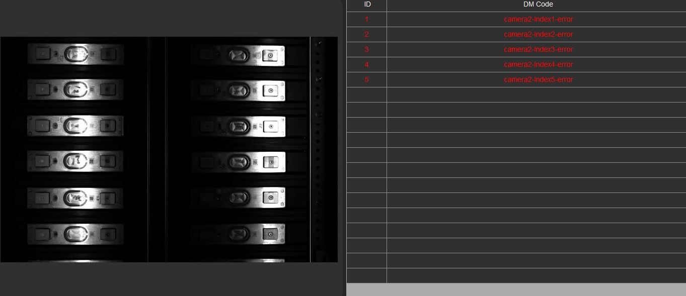
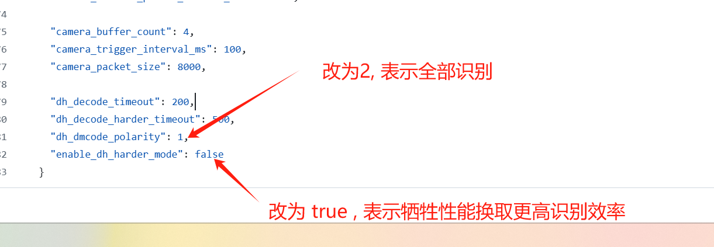

# DM码无法识别原因分析和解决方案
## 现象描述
拍照后，左侧有电芯码的图片，但是右侧DM code全部显示解码失败或者部分显示解码失败，且QR定位框标注无误，通过打光调焦尝试改善，但是问题仍然存在。    
    

## 可能原因和解决方案
### 1. 无virbox授权（全部解码失败）
无论是新部署的设备还是已部署并稳定运行的生产系统，首先确认是否有VirBox授权。且Virbox授权是否为永久，对于新部署的设备，可能存在未安装virbox，或者未导入授权文件，对于已部署并稳定运行的生产系统，可能存在使用的仍然是测试时临时授权文件，授权文件过期了，未及时更新。   

自检方法：   
打开Virbox软件，点击“我的软件”，查看软件的授权信息。     
如果出现下图类似的提示，则说明没有授权或者授权已过期。     
    

解决方案：
联系Yocto官方获取新的Virbox授权文件，导入到Virbox软件中，完成授权更新。
### 2. DM码无法识别（部分解码失败）
极端场景下，存在一些干扰因素，导致除正常白底黑码外，还因为反光出现了灰底白码，对于此类DM码无法识别。    

解决方案：     
某些极端场景, 需要打开D:\yocto\vsentry\vsentry.json文件，按下图修改下面两项的配置，并重启程序。   
   

## 问题记录
2025.12.21 原因2 硬件限制，存在灰底白码反光问题，导致部分无法识别    
2025.12.25 原因1 未升级永久Virbox授权，授权过期导致全部无法识别      
2025.12.27 原因1 未升级永久Virbox授权，授权过期导致全部无法识别        