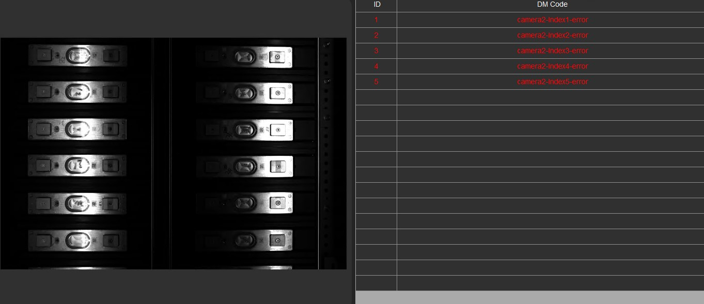
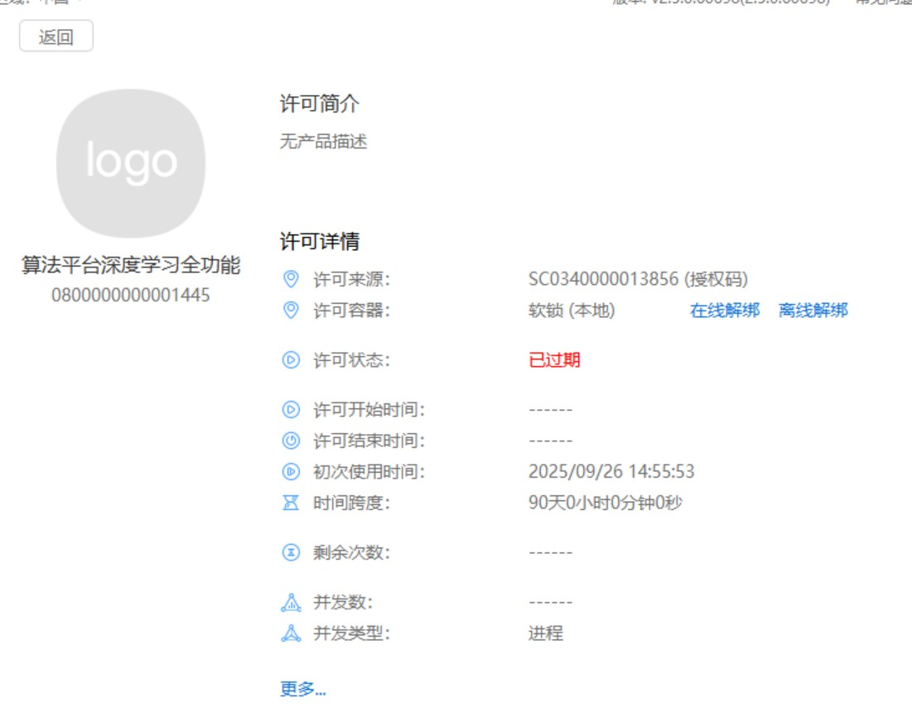
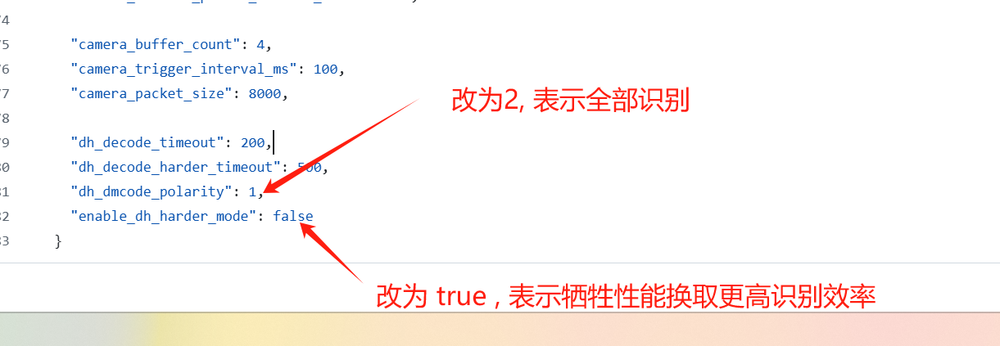

# DM码无法识别原因分析和解决方案

## 现象描述
拍照后，左侧有电芯码的图片，但是右侧 DM code 全部显示解码失败或者部分显示解码失败，且 QR 定位框标注无误，通过打光调焦尝试改善，但是问题仍然存在。

## 可能原因和解决方案

### 1. 无 Virbox 授权（全部解码失败）
无论是新部署的设备还是已部署并稳定运行的生产系统，首先确认是否有 VirBox 授权，且 Virbox 授权是否为永久。对于新部署的设备，可能存在未安装 virbox 或者未导入授权文件的情况；对于已部署并稳定运行的生产系统，可能存在使用的仍然是测试时临时授权文件，授权文件过期了，未及时更新。

**自检方法**：
1. 打开 Virbox 软件，点击“我的软件”
2. 查看软件的授权信息
3. 如果出现下图类似的提示，则说明没有授权或者授权已过期

**解决方案**：
联系 Yocto 官方获取新的 Virbox 授权文件，导入到 Virbox 软件中，完成授权更新。

### 2. DM码无法识别（部分解码失败）
极端场景下，存在一些干扰因素，导致除正常白底黑码外，还因为反光出现了灰底白码，对于此类 DM 码无法识别。

**解决方案**：
某些极端场景，需要打开 `D:\yocto\vsentry\vsentry.json` 文件，按下图修改相关配置，并重启程序。

## 问题记录

- 2025.12.21 原因 2：硬件限制，存在灰底白码反光问题，导致部分无法识别
- 2025.12.25 原因 1：未升级永久 Virbox 授权，授权过期导致全部无法识别
- 2025.12.27 原因 1：未升级永久 Virbox 授权，授权过期导致全部无法识别