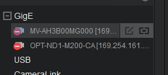
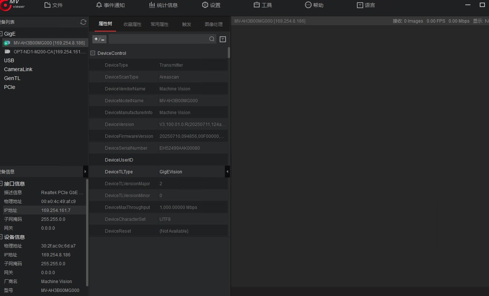

# MV Viewer调焦软件无图像原因分析和解决方案   
在使用YoctoVisionAI软件后，当前的图像不能满足生产需求，需要重新进行打光或者调焦，此时打开MV Viewer软件，MV软件界面显示三个相机，但是无法连接或者连接没有图像。    
## 可能原因和解决方案：    
### 1.未设置DHCP（新机）    
对于新接入的OPT相机设备，其默认地址为：192.168.10.2，请确保其已设置DHCP，否则，相机无法正常连接。     

自检方案：           
MV viewer程序中，相机IP地址为192.168.10.2，且打开YoctoVisionAI软件，软件无法启动。     

解决方案：        
使用OPT相机软件，根据部署文档将相机设置为DHCP，获取到IP地址后，再启动MV Viewer软件进行调焦。    

### 2相机被其他软件占用（不能连接）
使用YoctoVisionAI后，YoctoVisionAI软件没有及时关闭，同时已经打开了MV Viewer软件，此时MV Viewer软件会占用相机的USB端口，导致MV Viewer软件无法连接到相机启动。    

解决方案：     
关闭YoctoVisionAI软件，再重新启动MV Viewer软件。    

   

### 3未关闭软触发模式
使用YoctoVisionAI后，及时关闭，此时MV Viewer可以连接到相机启动，但是MV Viewer软件无法正常显示图像。此时是因为YoctoVisionAI软件启动时开启了软触发模式，但是MVViewer软件是硬触发模式，导致无法正常显示图像。      

解决方案：       
MV Viewer软件中，点击相机，进入图下界面，选中触发，将软触发关闭          
        

# 问题记录     
2025.12.21 原因3：未及时关闭软触发