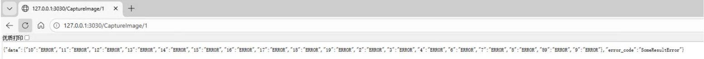
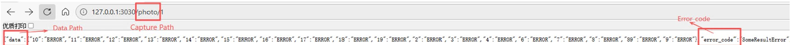
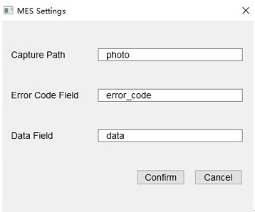

# 调度适配问题及相关解决方法
在工厂环境下，和产线调度人员沟通时，可能会遇到一些适配问题。以下是一些常见的问题及其解决方法     

## 适配问题拍照地址
配置的CCD拍照地址是http: //IP:端口/CaptureImage，(端口默认为3030)    
当CCD部署好了后，访问 http: //IP:3030/CaptureImage（例如：http: //192.168.10.2:3030/CaptureImage）    
调度方有问题时，可以通过此网址对象进行测试，并返回结果。     

## 适配问题详细说明
访问成功后，会返回拍照识别结果    
http: //{ip}:{port}/CaptureImage/{group}       
ip:         ccd的本机ip        
port:     ccd的服务端口         
group:   ccd的组(工位1或工位2, 可自定义), 如果只有1个工位, 则为空   
双工位时，通过设置{group}，可以单独对该工位进行拍照识别， 如http: //{ip}:{port}/CaptureImage/1  
## 适配问题示例
若使用ccd的本机ip，如下图中，本机ip为127.0.0.1，端口3030，组为1，则访问地址为http: //127.0.0.1:3030/CaptureImage/1    
将返回识别结果，图上数据无样品，所以显示对应框的ID和error，若有样品，则显示对应框的ID和code       
   

## 接口参数修改问题(1.2版本功能)
调度输入为http://{ip}:{port}/{ Capture Path }/{group}时也可以拍照     
Capture Path默认为CaptureImage, 可在设置中修改为其他名称，如Photo（如下图）       
     
接口参数名支持通过程序修改，Capture Path 可以在设置——>MES Setting中设置，同时也可以设置网址中显示的错误代码字段和数据字段   
   

## 其他现场问题说明
在设备管理及日常调度工作中，序列号（包括现场手动填报及官方提供的机器码）均需依赖人工输入，序列号错误时请务必确认有无遗漏和错误输入（例如i和L:I和l），请及时联系官方确认，并修改为正确的序列号    

## 问题日志
2025.12.19   
2026.01.20   这个 CaptureImage 的 I 是 大写的 i,不是小写的L，I输入错误，导致404错误      
