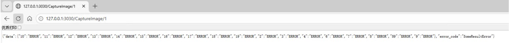
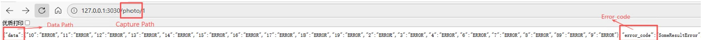
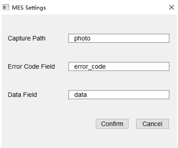

# 调度适配问题及相关解决方法

在工厂环境下，和产线调度人员沟通时，可能会遇到一些适配问题。以下是一些常见的问题及其解决方法：

## 适配问题拍照地址

配置的 CCD 拍照地址是 `http://IP:端口/CaptureImage`（端口默认为 3030）

当 CCD 部署完成后，访问 `http://IP:3030/CaptureImage`（例如：`http://192.168.10.2:3030/CaptureImage`）

调度方有问题时，可以通过此网址进行测试，并返回结果。

## 1. 适配问题详细说明

访问成功后，会返回拍照识别结果：

```
http://{ip}:{port}/CaptureImage/{group}
```

- **ip**: ccd 的本机 IP
- **port**: ccd 的服务端口
- **group**: ccd 的组（工位 1 或工位 2，可自定义），如果只有 1 个工位，则为空

双工位时，通过设置 `{group}`，可以单独对该工位进行拍照识别，如 `http://{ip}:{port}/CaptureImage/1`

## 2. 适配问题示例

若使用 ccd 的本机 IP，例如本机 IP 为 127.0.0.1，端口 3030，组为 1，则访问地址为 `http://127.0.0.1:3030/CaptureImage/1`

将返回识别结果，图上数据无样品时，显示对应框的 ID 和 error；若有样品，则显示对应框的 ID 和 code。



## 3. 接口参数修改问题（1.2 版本功能）

调度输入为 `http://{ip}:{port}/{Capture Path}/{group}` 时也可以拍照

- **Capture Path** 默认为 CaptureImage，可在设置中修改为其他名称，如 Photo



接口参数名支持通过程序修改，Capture Path 可以在设置 → MES Setting 中设置，同时也可以设置网址中显示的错误代码字段和数据字段。



## 4. 拍照超时警告问题

### 现场问题
CCD 间隔一段时间就会提示警告 "buffer timeout or unavailable"，调度反映为一直无法拿到拍照结果，并且一直显示等待拍照完成。

### 解决方法
运行程序时，`camera_trigger_interval_ms` 这一项为 100 时，会为了提升识别率消耗些许性能。目前的 CCD 识别率已经打标的情况下，建议将 `D:/yocto/vsentry/vsentry.json` 文件中的 `camera_trigger_interval_ms` 参数设置为 0。


## 5. 其他现场问题说明

1. 调度访问 `http://{ip}:{port}/CaptureImage/{group}` 时，需注意 **CaptureImage 的 I 是大写的 i，不是小写的 L**，I 输入错误将导致 404 错误

2. 在设备管理及日常调度工作中，序列号（包括现场手动填报及官方提供的机器码）均需依赖人工输入，序列号错误时请务必确认有无遗漏和错误输入（例如 i 和 L、I 和 l），请及时联系官方确认，并修改为正确的序列号

## 问题日志

- 2025.12.19
- 2026.01.20：CaptureImage 的 I 是大写的 i，不是小写的 L，I 输入错误导致 404 错误