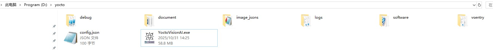

# 软件重装步骤

## 1. 备份数据
 
在重装操作系统之前，请确保备份所有重要数据和文件，以防止数据丢失：

- **备份yocto目录：** 将Yocto（D:\yocto）文件夹备份到移动硬盘、U盘，确保整个目录完整拷贝

- **备份软锁文件：** 找到之前本机的.D2C文件，保存到移动硬盘或U盘。  

## 2. 安装软件     

在重装系统后，要恢复Yocto工作环境，请按照以下步骤操作：    

+ **恢复yocto目录：** 将前面步骤中备份的整个Yocto文件夹复制或解压到d盘根目录，确保目录正确，如下图    
 

+ **安装软件：** 在 D:\yocto\install 目录, 点击并安装附属软件: vc_redist.x64.exe 以及 sense_shield_installer_pub.exe

+ **导入软锁：** 将前面步骤中保存的 .D2C 文件导入，提示导入/升级成功 (序列号不变)      

## 3. 运行软件     
完成上述步骤后，将 D:\yocto\YoctoVisionAI.exe 发送快捷方式到桌面，并运行 YoctoVisionAI.exe文件，即可启动软件，并检查软件正确性     