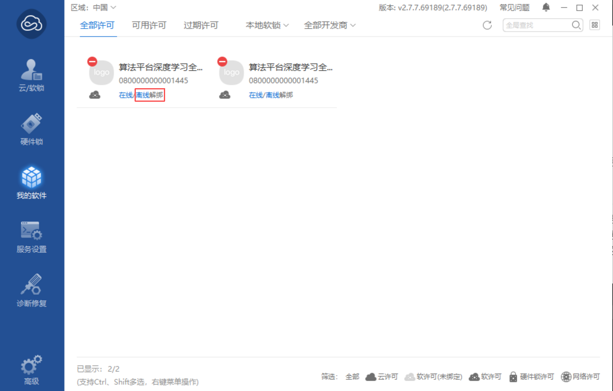
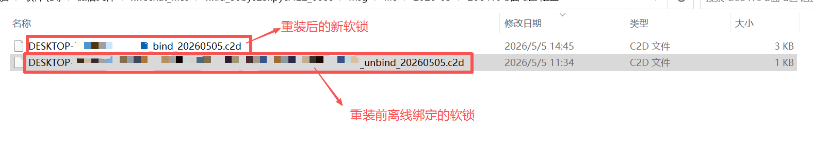

# 重装系统后软锁变更

---

## 问题描述

重装操作系统后，软锁信息会发生变更，导致已绑定的 D2C 文件失效。需要在重装系统前进行解绑操作，重装完成后再重新绑定。

---

## 解决方法

### 步骤 1：重装前离线解绑

在重装系统之前，请先执行以下操作：

1. 打开 **Virbox 用户工具**
2. 点击 **"我的软件"** 选项卡
3. 在软件列表中找到目标软锁
4. 点击 **"离线解绑"** 按钮
5. 操作完成后，会生成一个 **C2D 文件**（请妥善保存）

### 步骤 2：准备文件并联系技术支持

重装系统完成后，请按照以下步骤操作：

1. 获取重装系统后新生成的 **C2D 文件**
2. 将以下两个文件放置在同一目录下：
   - 重装前离线解绑获得的 C2D 文件
   - 重装系统后新获取的 C2D 文件
3. 将该目录打包发送给 **官方技术支持团队**

### 步骤 3：导入新软锁

技术支持团队处理完成后：

1. 收到技术支持提供的 **新软锁文件**
2. 打开 **Virbox 用户工具**
3. 导入新的软锁文件
4. 验证软锁绑定成功

---

> **提示**：请确保在重装系统前完成离线解绑操作并保存 C2D 文件，否则可能导致软锁无法正常解绑。