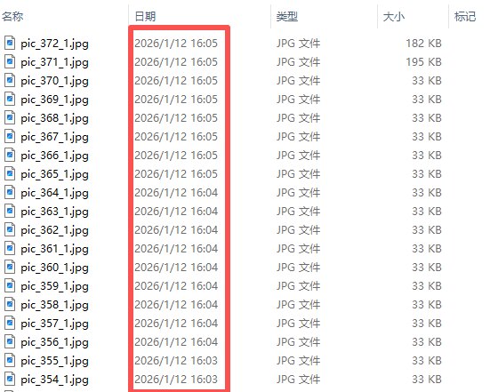
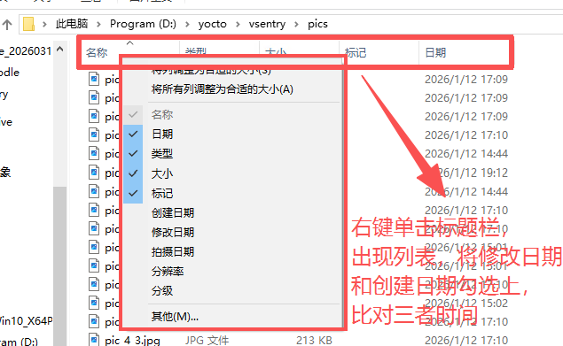
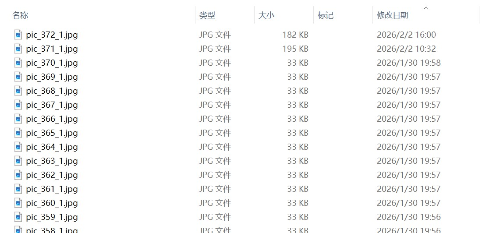

# 图像时间戳显示异常排查

---

## 现象说明

进入工作目录 `D:/yocto/vsentry`，进入该目录下的 `orig` 目录或 `pics` 目录，找不到需要的图片，并且发现文件列表里显示的"日期"不对。

我们本来想看的是当天最新的图片，但显示的却是三天前的日期，且这三天里一直有图片在进行识别。

---

## 原因说明

此现象并非图片本身的元数据问题，而是 Windows 系统下文件资源管理器的**视图配置或列显示错误**。

在默认的"详细信息"视图下，资源管理器应明确区分"创建日期"和"修改日期"两列。当用户看到的时间信息与预期的"最后内容更改时间"不符，通常是因为：

- 当前视图所显示的列标题实际为"创建日期"，而非"修改日期"
- "修改日期"列被意外移除或隐藏

---

## 解决方法

1. 打开需要查看的图片目录
2. 右键单击目录的标题栏（如下图所示）
3. 将标题栏中的"日期"或"创建日期"取消勾选
4. 勾选"修改日期"即可

5. 修改完成后，刷新目录视图，即可看到正确的"修改日期"，修改日期就是真实的图像或文件内容更改时间

