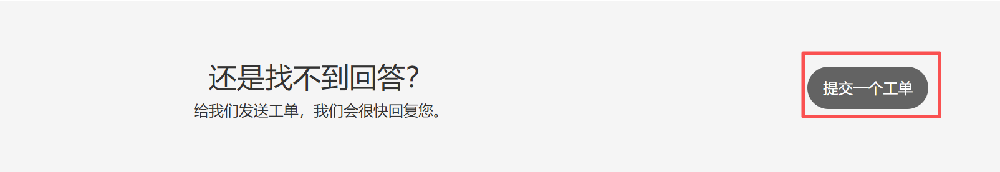
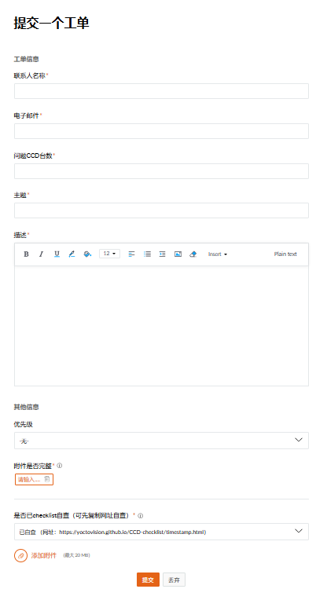
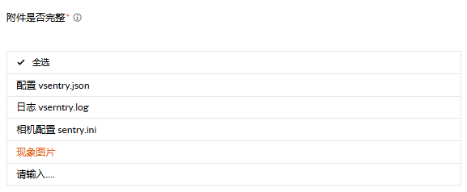
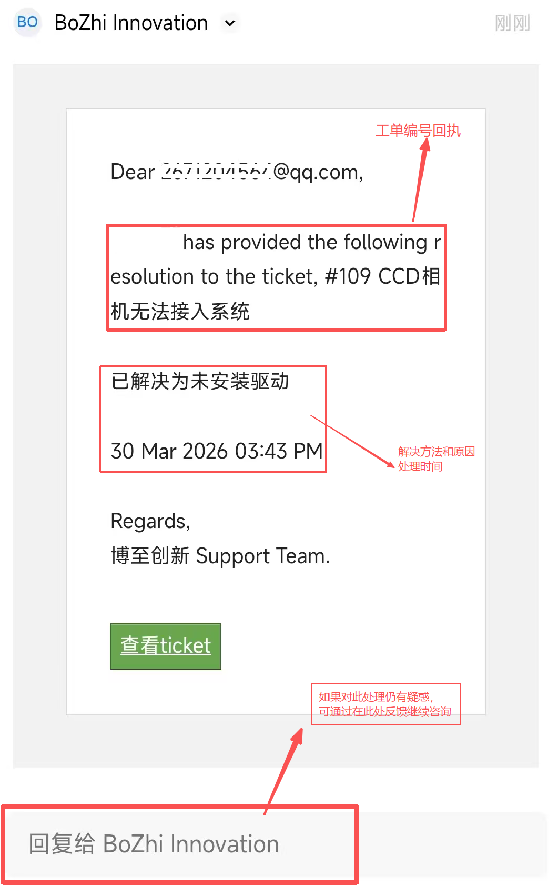
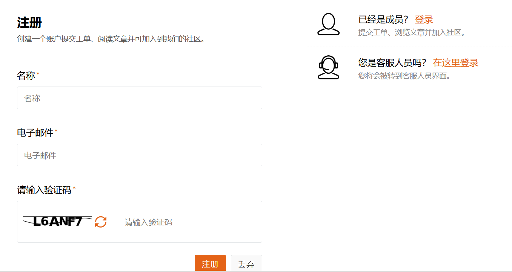
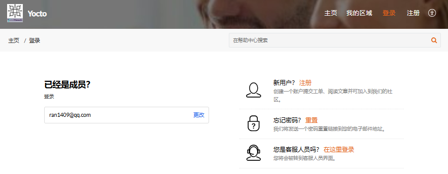
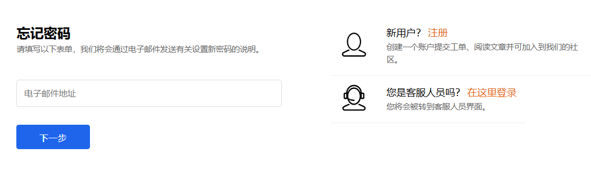

# 产品咨询工单提交指南

## 1. 简介

本文档为客户提供使用 `https://bozhiinnovation.zohodesk.com/portal/` 提交产品咨询工单的详细指南。无需登录，只需填写表单并提交，系统会通过邮箱向您发送工单回执。

## 2. 访问工单提交页面

1. 打开浏览器，输入网址：`https://bozhiinnovation.zohodesk.com/portal/`
2. 进入 Yocto 团队的工单管理系统门户页面
   
3. 将界面拉到最底部，点击「提交一个工单」按钮
   

## 3. 工单表单填写指南

本文档将详细介绍工单表单的填写指南。

### 3.1 基本信息

| 表单字段 | 填写说明 | 示例 |
|---------|---------|------|
| **联系人姓名** | 填写您的真实姓名 | 张三 |
| **电子邮箱** | 填写您的工作邮箱（用于接收工单回执） | zhangsan@factory.com |
| **问题CCD台数** | 填写问题相关的 CCD 台数 | 10台 |

### 3.2 问题信息

| 表单字段 | 填写说明 | 示例 |
|---------|---------|------|
| **主题** | 简要描述问题，包含设备类型和问题类型，发生时间 | CCD相机无法接入系统 |
| **详细描述** | 详细描述问题现象、发生时间、影响范围等 | 运行YoctoVisionAI.exe时，弹出"获取相机信息失败，是否跳过检测直接进入程序"错误，多次尝试后仍无法进入软件主界面 |
| **优先级** | 根据问题紧急程度选择 | 中（影响生产但可临时处理） |
| **附件是否完整** | 确认已上传必要的附件文件，上传如（日志、配置、错误截图等，根据实际情况上传勾选） |  全选 |

### 3.3 附件上传

| 表单字段 | 填写说明 | 示例 |
|---------|---------|------|
| **附加文件** | 上传相关截图、日志文件等 | vsentry.log日志，配置文件、错误截图 |

### 3.4 提交工单

1. 仔细检查填写的信息是否完整准确
2. 确认已上传必要的附件文件
3. 点击「提交」按钮
4. 系统会显示提交成功的提示信息
5. 当工单处理完成后，您的邮箱会收到工单回执，包含工单编号和处理状态

- **通过邮箱跟踪**：您可以通过邮件回复与技术支持团队沟通
- **响应时间**：技术支持团队会在工作日 10:00-19:00 内处理工单

## 4. 常见问题与注意事项

### 4.1 表单填写注意事项

- **必填字段**：确保所有带星号(*)的字段都已填写
- **详细描述**：尽可能详细描述问题，有助于技术人员快速定位
- **附件上传**：上传日志文件和错误截图，能大大提高问题解决速度
- **联系信息**：确保邮箱地址正确，以便接收工单回执

### 4.2 常见问题处理建议

在提交工单前，请先对照自查表 [https://yoctovision.github.io/CCD-checklist/timestamp.html](https://yoctovision.github.io/CCD-checklist/timestamp.html) 进行问题分析

### 4.3 联系信息

**注意**：工单提交后，技术支持团队会尽快与您联系。请保持电话畅通，并准备好相关设备以便远程协助。

## 5. 邮箱注册（建议注册）

提交工单无需注册，但为了方便跟踪工单处理进度，对照历史工单，查看历史工单解决方法，建议您注册，注册后登录可以在该网站查看历史工单详情。

### 5.1 注册步骤

**1. 进入 Yocto 团队的工单管理系统门户页面：** `https://bozhiinnovation.zohodesk.com/portal/`

**2. 点击右上角「注册」按钮**
   

**3. 填写注册信息，包括名称（姓名），电子邮件，完成注册**
   

**4. 系统提示："邮件已经发送到您的邮箱，请点击邮件中的链接完成注册确认"**
   - 查看您的邮箱（包括垃圾邮件），确认是否收到确认邮件
   - 如果收到，请点击邮件中的链接进行激活完成注册（跳过步骤5、6）
   - 如果未收到，请继续按步骤操作
   

**5. 如果未收到邮件，回到工单管理系统门户页面，点击登录按钮**
   - 输入注册时填写的邮箱，点击下一步
   - 此时无法显示密码输入框，说明注册未完成，需要先激活
   - 点击右侧的忘记密码栏的重置按钮
   

**6. 在忘记密码页面，输入注册时填写的邮箱，点击下一步**
   - 系统显示动态验证码已经发送到注册邮箱
   - 输入验证码进行验证
   - 验证成功后，设置新密码（密码长度至少8位，包含数字、字母、特殊字符三种）
   

**7. 回到登录界面，输入登录邮箱和密码**
   - 成功登录后，点击工单或者我的区域查看所有工单详情，同时可以在单个工单中进行留言沟通
   